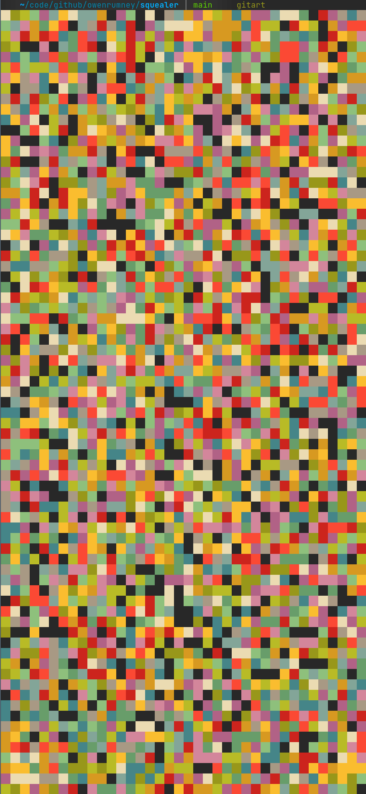

# gitart
Git Commits as Artwork

## What is this?

It's pointless!

Still here?

Generate some fantastic art from your git commit ids.

## Usage

### Installing

To install, use go install

```shell
go install github.com/owenrumney/gitart@latest
```

### Using it

1. Go to a directory with git commits init
2. Run gitart (assuming its on your PATH)

## How awesome can the art really get?

Well, this is the artwork from [owenrumney/squealer](https://github.com/owenrumney/squealer)



### Is that really it?

Yup - soz